# Foote Field 3D Human Pose Estimation

Foote field camera calibration and 3D pose estimation project.

## Components

1. **calibration/detect_chessboard.py**: Loads calibration images and detects the chessboard in the image if present. Depends on `calibration/detect_chessboard_rgb.py` and `calibration/detect_chessboard_infrared.py`.

Image RGB chessboard points | Image infrared chessboard points
:-------------------------:|:-------------------------:
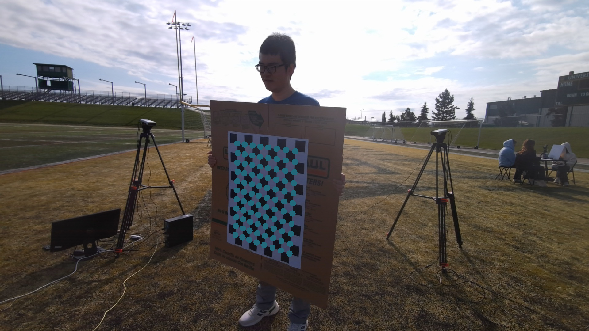  |  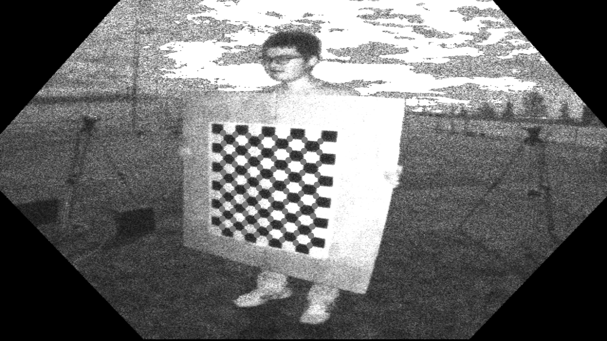

1. **calibration/calc_intrinsic.py**: Using the cached chessboard points detected by `calibration/detect_chessboard.py` calculates the intrinsic parameters of each camera.

Distorted image | Undistorted image
:-------------------------:|:-------------------------:
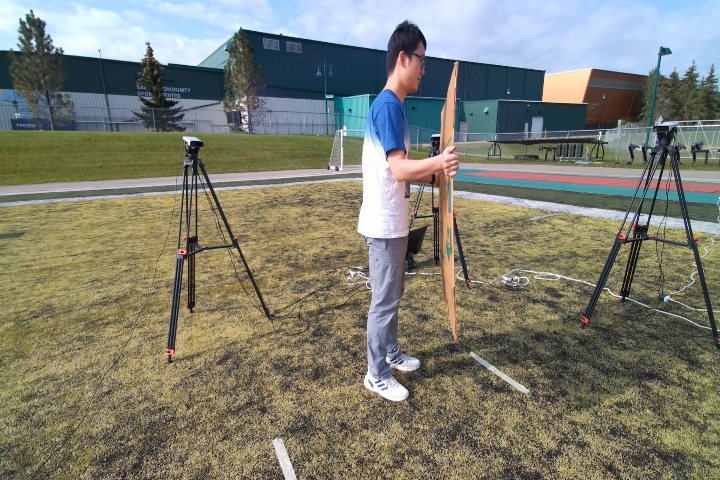  |  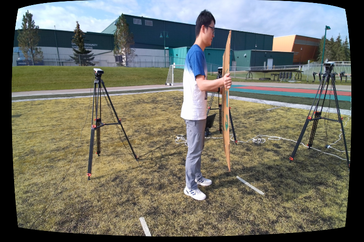

1. **calibration/calc_extrinsic.py**: Finds matching images from all images with a valid chessboard detected. Finds extrinsic parameters between each pair of matching cameras.

Left stereo matched image | Right stereo matched image
:-------------------------:|:-------------------------:
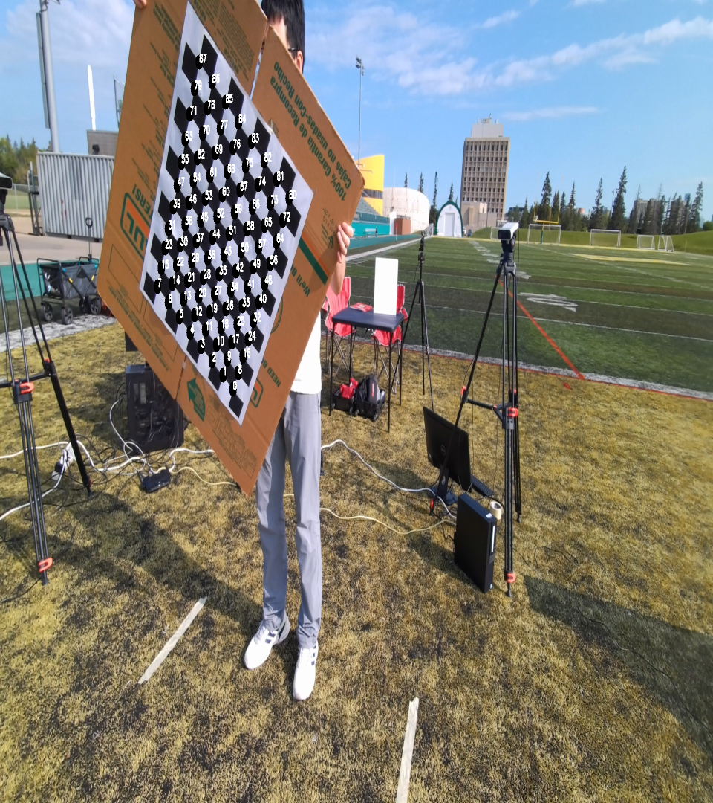  |  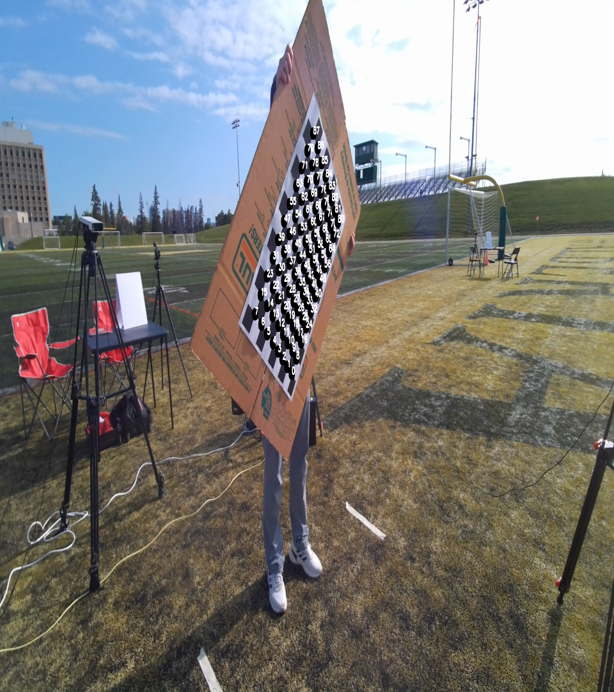

1. **calibration/rgb_depth_calibration.py**: Aligns the RGB and infrared images from each camera to enable accurate depth estimation of each point on the image.

RGB/infrared match 1 | RGB/infrared match 2
:-------------------------:|:-------------------------:
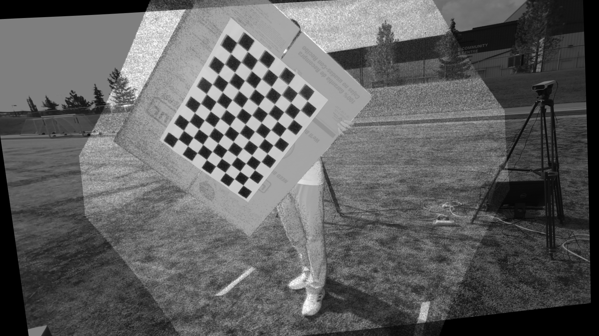  |  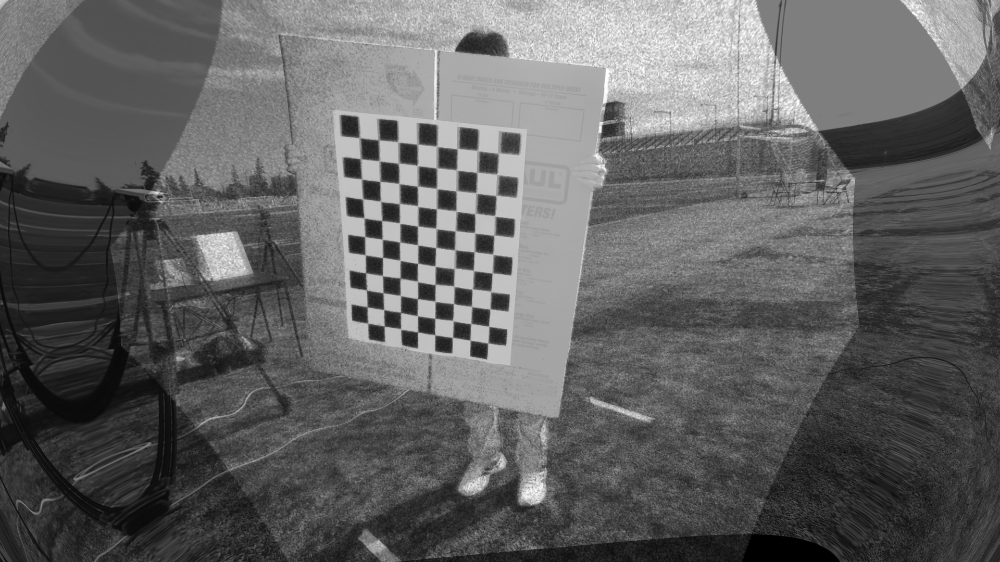

1. **calibration/rgb_depth_map.py**: Finds the corresponding points on the RGB and depth image by aligning the two images.

RGB and corresponding depth match 1 |
:-------------------------:|
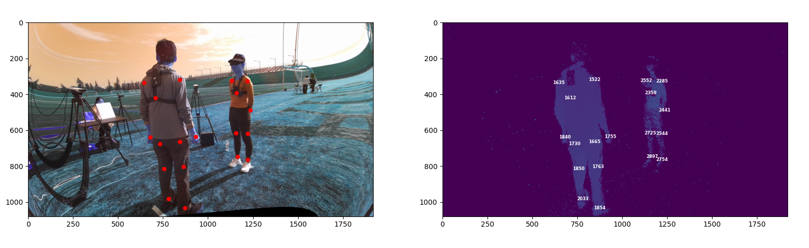  |

1. **pose_estimation/mmpose_test.py**: Visualizes the skeleton keypoints found by the `mmpose` library on an arbitrary image.

mmpose sample 1 | mmpose sample 2
:-------------------------:|:-------------------------:
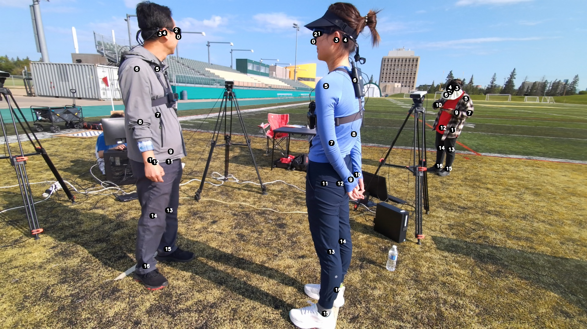  |  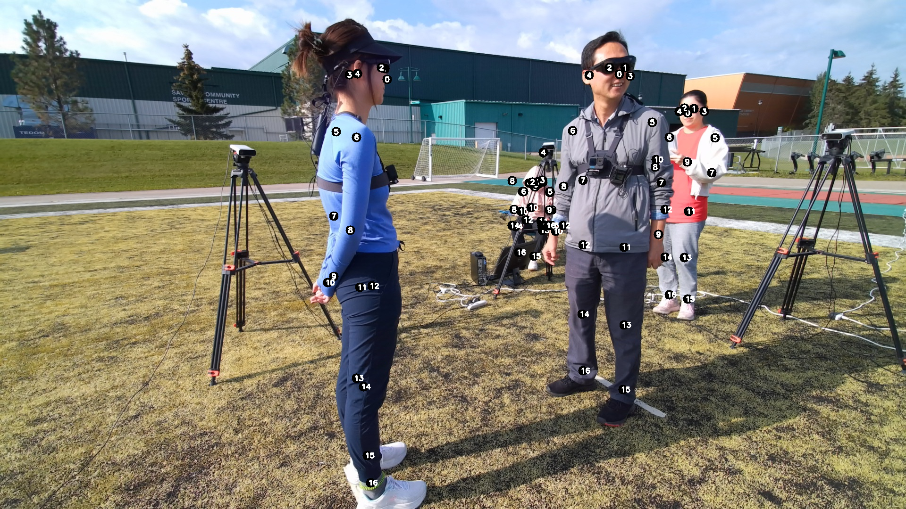

1. **calibration/pose_animation.py**: Visualizes a 3D animation of the skeletons detected from subsequent frames of each experiment.

Skeleton animation (angle 1) | Skeleton animation (angle 2)
:-------------------------:|:-------------------------:
  |  


## Setup

```bash
pip install -r requirements
```

## Usage

Run the scripts in this order:

`calibration/detect_chessboard.py` -> `calibration/calc_intrinsic.py` -> `calibration/calc_extrinsic.py` -> `calibration/rgb_depth_calibration.py` -> `pose_estimation/pose_animation.py`


## TODO

1. Feature: Calculate point depths using triangulation between adjacent cameras.
1. BugFix: Make `calibration/pose_animation.py` more stable.
1. Feature: Make the calibration process simpler by implementing a single end-to-end script.
1. Feature: Add SMPL to the pose animation.
1. Feature: Make pose estimation in the pose animation fasters or increase its hardware utilization (can use GPU?)
1. Feature: Remove unwanted skeletons from the pose animation
1. Feature: Add dataset information
1. Feature: Add arguments for script execution


## Known issues

1. Depth estimation using single camera depth information is noisy.


## Contributors

- Shihao Zou: szou2@ualberta.ca
- Hamid Mohammadi: hamid4@ualberta.ca
